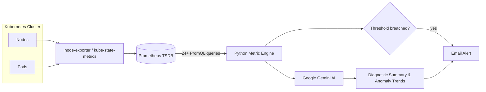
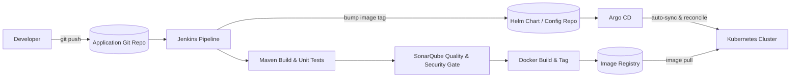
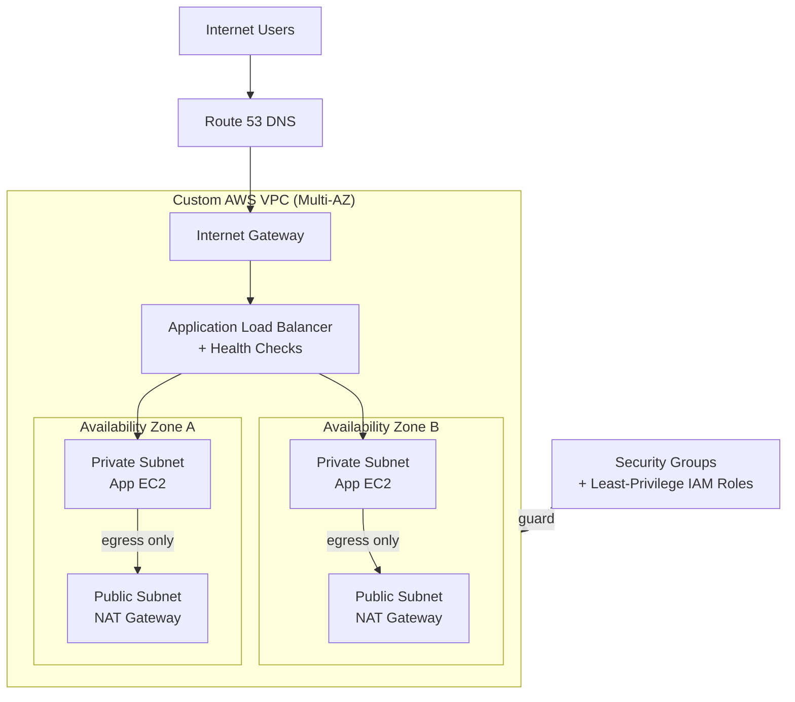

# Hi there, I'm Venkata Naveen Reddy Yaparla 👋

  📍 <strong>Bengaluru, India</strong> &nbsp; | &nbsp; ✉️ <strong>naveenreddyyaparla9@gmail.com</strong> &nbsp; | &nbsp; 📱 <strong>+91 9493923026</strong>

<!-- Social, Contact & Resume Badges -->

  
  
  
  
  

---

## 📌 Executive Summary

> **DevOps Engineer with 3+ years of experience** architecting high-availability **AWS cloud infrastructure**, orchestrating **Kubernetes (EKS)** microservices, designing automated **CI/CD & GitOps pipelines**, and provisioning **Infrastructure as Code (IaC)** via Terraform. Skilled in Kubernetes observability, PromQL metric engineering, AI-assisted infrastructure reporting, automated patch management, and deployment optimization to enhance reliability and MTTR.

---

## 🛠️ Technical Arsenal & Core Competencies

### ☁️ Cloud & Infrastructure

  
  
  
  
  
  
  

### 🚢 Containers, Orchestration & Ingress

  
  
  
  

### ⚙️ Infrastructure as Code & Configuration Management

  
  

### 🔄 CI/CD, GitOps & Automation

  
  
  
  
  
  

### 📊 Observability, Monitoring & Logging

  
  
  
  

### 💻 Scripting & Programming

  
  

---

## 💼 Professional Experience

### 🏢 **DevOps Engineer** | **Tecnotree Convergence Limited**
*Bengaluru, India &nbsp;|&nbsp; August 2023 – Present*

- **CI/CD Pipeline Automation**: Designed and maintained enterprise **Jenkins** and **GitHub Actions** CI/CD pipelines for Java applications, fully automating build, test, and containerized deployments to Kubernetes — replacing manual release steps with repeatable, self-service deploys.
- **EKS Cluster Orchestration**: Architected and managed production **AWS EKS** clusters hosting containerized microservices using Helm charts, Deployments, StatefulSets, Ingress, ConfigMaps, and Secrets across Staging and Production environments.
- **Infrastructure as Code (IaC)**: Provisioned and managed scalable AWS infrastructure (`VPC`, `EC2`, `IAM`, `ALB`, `Route53`, `S3`) using modular, reusable **Terraform** (remote state with S3/DynamoDB backends), **Ansible**, Bash, and Python — making Staging and Production reproducible from version-controlled code.
- **Observability & Proactive Alerting**: Built comprehensive monitoring, logging, and alerting infrastructure using **Prometheus**, **Grafana**, **ELK Stack**, and **AWS CloudWatch** — shifting incident detection from reactive to proactive and shortening MTTR.
- **OS Patch Automation**: Automated Linux server patch management across **20+ production servers** using Ansible playbooks, reducing execution time from **several hours to under 25 minutes**.
- **Production Administration**: Administered Linux-based production environments, handling infrastructure troubleshooting, system log analysis, and performance optimization.

---

## 🚀 Featured Projects

### 🤖 [Kubernetes Cluster Monitoring with AI](https://github.com/VenkataNaveenReddyYaparla/k8s-cluster-monitoring-with-ai)

An intelligent Kubernetes cluster observability platform that captures live telemetry across nodes and pods, analyzes cluster health using PromQL, and leverages Google Gemini AI for diagnostic summaries and automated alerts.

- **PromQL Metric Engine:** Executes 24+ PromQL queries analyzing node health, pod statuses, CPU/memory saturation, disk I/O, and network metrics.
- **AI-Powered Diagnostics:** Summarizes diagnostic insights and anomaly trends using **Google Gemini AI**.
- **Automated Alerting:** Dispatches real-time email notifications for critical incidents and performance degradation.

  
  
  
  
  

**[View GitHub Repository →](https://github.com/VenkataNaveenReddyYaparla/k8s-cluster-monitoring-with-ai)**

 

### 🔄 [End-to-End GitOps CI/CD Pipeline for Java Microservices](https://github.com/VenkataNaveenReddyYaparla/Jenkins_E2E_CICD/tree/main/java-maven-sonar-argocd-helm-k8s)

A production-grade, declarative CI/CD and GitOps delivery pipeline integrating automated builds, static code quality analysis, vulnerability scanning, and Helm-based zero-downtime deployment to Kubernetes via Argo CD.

- **Continuous Integration:** Orchestrated automated build and packaging via **Maven** with static code quality and security gate enforcement via **SonarQube**.
- **Containerization & Helm:** Automated Docker image creation, tagging, and parameter-driven Helm chart templating for Kubernetes deployments.
- **GitOps Continuous Delivery:** Integrated **Argo CD** for continuous reconciliation and automated sync between the Git repository and live Kubernetes cluster.

  
  
  
  
  
  

**[View Pipeline Architecture & Code →](https://github.com/VenkataNaveenReddyYaparla/Jenkins_E2E_CICD/tree/main/java-maven-sonar-argocd-helm-k8s)**

 

### ☁️ [High-Availability Multi-Tier App Deployment in AWS VPC](https://github.com/VenkataNaveenReddyYaparla/App_deployment_in_aws_vpc)

An enterprise-grade, secure cloud infrastructure architecture provisioning a multi-tier application environment in custom AWS VPC with isolated public/private networking and high availability.

- **Network Architecture:** Custom **AWS VPC** designed across multiple Availability Zones with public and private subnets, Internet Gateway, and NAT Gateway.
- **Traffic Routing & Security:** Configured **Application Load Balancer (ALB)**, Route53 DNS management, strict Security Groups, and least-privilege IAM roles.
- **Resilient Hosting:** Secure backend instance provisioning in private subnets with health checks and zero direct internet exposure.

  
  
  
  
  

**[View VPC Deployment & Documentation →](https://github.com/VenkataNaveenReddyYaparla/App_deployment_in_aws_vpc)**

---

## 🏆 Key Achievements & Honors

- 🌟 **Excellence Award** *(Sep 2025)* — Honored for exceptional performance in enhancing system reliability and automation at Tecnotree.
- 🚀 **Go-Live Award** *(Aug 2024)* — Recognized for outstanding contributions to successful project deployment and operational readiness.

---

## 🎓 Education

- **Bachelor of Technology (B.Tech) in Computer Science and Engineering**  
  *Annamacharya Institute of Technology and Sciences* &nbsp;|&nbsp; `2018 – 2022`

---

## 📈 Engineering Highlights & Quick Stats

| 🏷️ Domain | 🛠️ Primary Technologies | 🎯 Key Focus Areas |
| :--- | :--- | :--- |
| **Cloud Infrastructure** | AWS (VPC, EC2, IAM, S3, ALB, Route53) | High Availability, Security & Scalability |
| **Container Platform** | Kubernetes, Docker, Helm, AWS EKS | Microservices, Ingress & Zero-Downtime Deploys |
| **Automation & IaC** | Terraform, Ansible, Jenkins, GitHub Actions | GitOps, Automated OS Patching, Fast CI/CD |
| **Observability & AI** | Prometheus, Grafana, PromQL, ELK, Gemini AI | Anomaly Detection, Metrics & Low MTTR |

 

  
  
  

---

## 📫 Connect with Me

Open to discussing cloud infrastructure, Kubernetes, DevOps automation, and new engineering opportunities!

 

  
  
  
  

